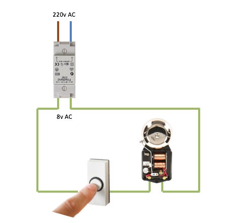
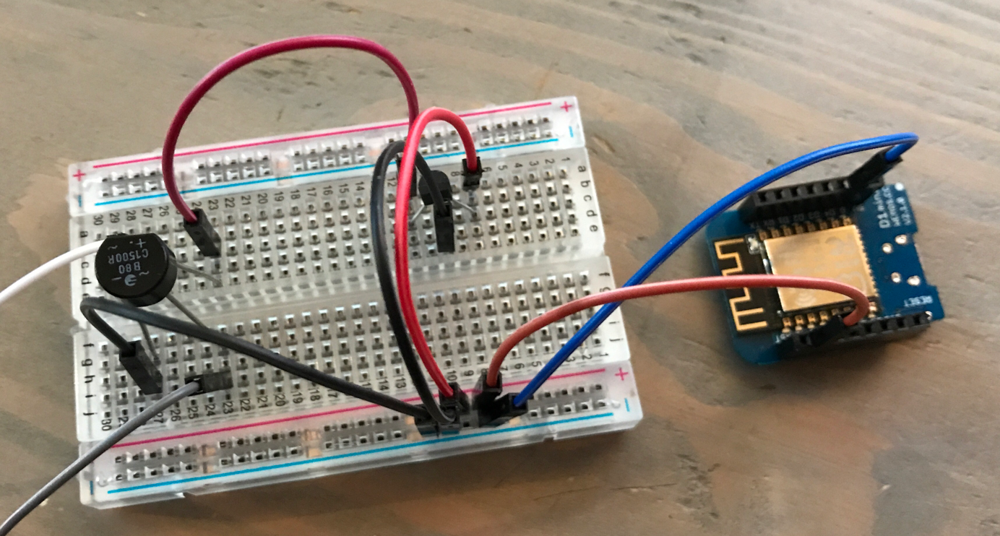
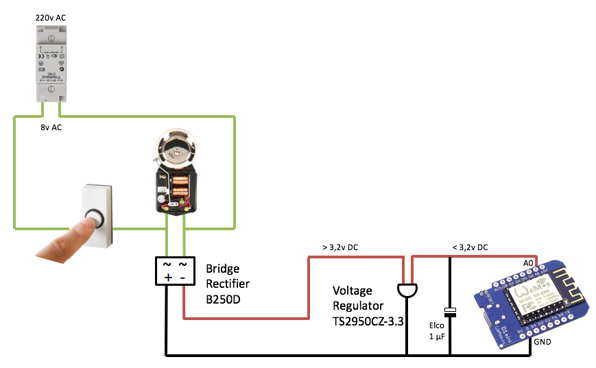
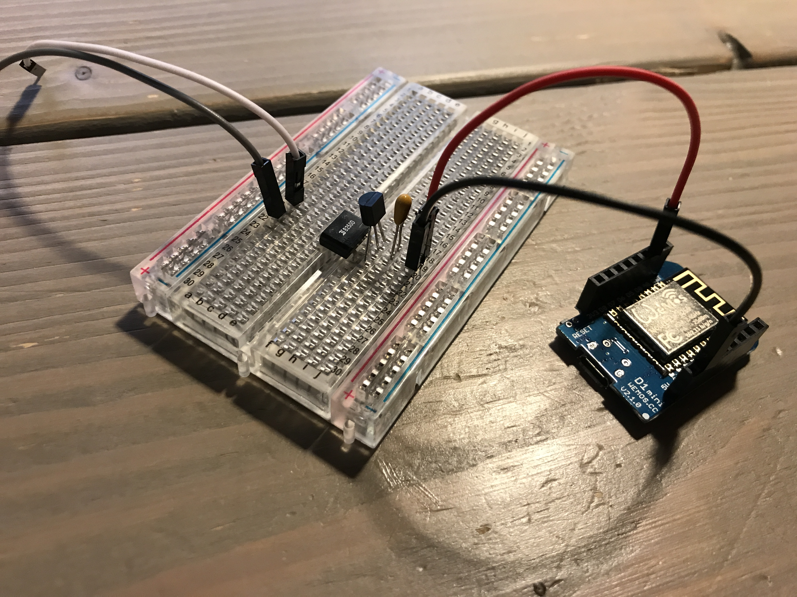

# Doorbell via Wemos

Doorbell project to determine if the doorbell was pressed.  

Version 1 was presented at the DomoticaGrunn Meetup #2. Slides can be found on [SpeakerDeck](https://speakerdeck.com/domoticagrunn/domoticagrunn-meetup-number-2). Version 2 is the [optocoupler based version](https://github.com/tIsGoud/Doorbell-via-Wemos-and-optocoupler) of this project.

It all started with the question "How to determine someone pressed the doorbell without interfering with the existing doorbell installation?".

My main requirements was that I did not want to mess with the existing setup or be dependant on extra components. I have seen several solutions, but sofar none of them met this requirement. ELMO

My doorbell installation is a standard Dutch doorbell installation:


Once the doorbell-button is pressed, the "signal" is send to the Wemos. The Wemos is connected to MQTT via the local Wi-Fi.
Home Assistant picks up the signal from MQTT. From there it's up to your imagination what you want to do with the input. 
For now I send a message to a Slack-bot to notify me.


## Hardware v1.0

For the initial setup [Rudi](http://www.rudiniemeijer.nl) a colleague helped me out with the design and some components he had lying around:
- Bridge Rectifier, B80 1500R
- Voltage Regulator, 3.3V

The Bridge Rectifier converts AC to DC and the Voltage Regulator brings the voltage below the max 3.3V that the Wemos can handle on the A0 pin.


The initial setup worked, the measured voltage on the Wemos was between 1 and 2V. This was the setup presented at the DomoticaGrunn Meetup.



## Hardware v1.1

The first hardware setup was without stabilization. After presenting it I got the advice to add extra components for stabilization.

I still used the same components from v1 but added two capacitors.


The resulting voltage remained between 1 and 2V.

## Hardware v1.2

To make this project reproducable for others I decided to get some new components from our local electronics store.

New components:
- Bridge Rectifier, B250D DIP4
- Voltage Regulator, TS2950CZ-3.3
- Capacitor, 1µF

The B250D was in a DIP4 form factor, which results in a very clean breadbord design.





The new components also had a positive effect on the measured voltage. Instead of the the value between 1 and 2V it now produces results between 2 and 3V. 

## Hardware v2.0

Version 2 of the hardware is based on an optocoupler, [Doorbell via Wemos and optocoupler](https://github.com/tIsGoud/Doorbell-via-Wemos-and-optocoupler).

## Software v1.0

On the Wemos I use [Homie for ESP8266](https://github.com/marvinroger/homie-esp8266) to:
- Connect and stay connected to the Wi-Fi
- Connect and stay connected to MQTT
- Send data to MQTT

Inspired by the [Wemos D1 mini ReadAnalogVoltage example](https://github.com/wemos/D1_mini_Examples/tree/master/examples/01.Basics/ReadAnalogVoltage) the voltage is read on the A0 pin.

The analog voltage is read in a loop with a delay defined in the variable "readDelay". Otherwise it would be polling constantly.

To prevent multiple triggers when the button is either pressed very long or multiple times I use the "buttonPressDelay" variable. Setting "buttonPressDelay" to a value of 3 to 5 seconds works fine and results in just one trigger.

The readDelay and buttonPressDelay values are set in milliseconds.

## Home Assistant configuration

I use [Home Assistant](https://home-assistant.io/) for home automation.
Below are the parts of the Home Assistent configuration that handle the MQTT message and send me a notification via Slack:

```
automation:
- alias: "Doorbell pressed"
  hide_entity: True
  trigger:
    platform: mqtt
    topic: wemos/doorbell/button/pressed
    payload: 'true'
  action:
    service: notify.Slack
    data:
      message: "Someone at the door!"
      title: "Doorbell says ..."
 ```
 
 ```
 notify:
  - name: Slack
    platform: slack
    api_key: !secret Slack_API-key
    username: !secret Slack_Username
    default_channel: '#hass'
    icon: ':house:'
```      
