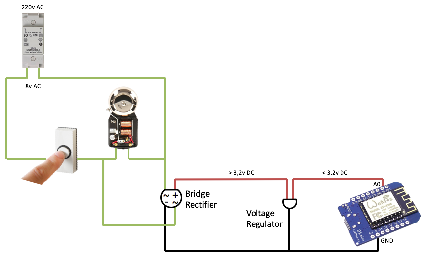

# Doorbell-via-Wemos

Doorbell project to determine if the doorbell was pressed.

Version 1 was presented at the DomoticaGrunn Meetup #2. Slides can be found on [SpeakerDeck](https://speakerdeck.com/domoticagrunn/domoticagrunn-meetup-number-2).

It all started with the question "How to determine someone pressed the doorbell without interfering with the existing doorbell installation?".

My main requirements was that I did not want to mess with the existing setup or be dependant on extra components. I have seen several solutions, but sofar none of them met this requirement. ELMO

My doorbell installation is a standard Dutch doorbell installation:

## Hardware v1.0
For the initial setup a colleague helped me out with the initial design and with some components he had lying around:
- Bridge Rectifier, B80 1500R
- Voltage regulator, 3.3V

The initial setup worked, the measured voltage on the Wemos was between 1 and 2V. This was the setup presented at the DomoticaGrunn Meetup.
